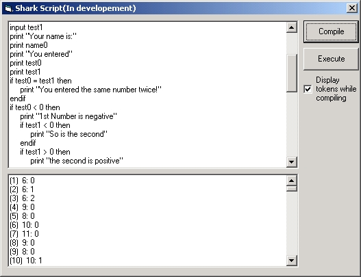



## Script Engine \(not script control\)

### Description

Scripting engine based off pointers and OP codes. Updated 4/6/02(I fixed the order of operations problem, I think:)
 
### More Info
 
gotta make a script. It auto loads with a sample script.

check my website for updates to it

it outputs anything that your decide to "print"

it does not have a debugger or anything therefor if you enter inproper script(for example: end if which is incorrect compared to endif which is correct) you run the chance of getting errors/improper output and even worse never ending loops. Just make sure you check your script before you compile/execute.

             |
---                |---
**Submitted On**   |2002-04-06 14:45:22
**By**             |[Patrick Rogers\-Ostema](https://github.com/Planet-Source-Code/PSCIndex/blob/master/ByAuthor/patrick-rogers-ostema.md)
**Level**          |Advanced
**User Rating**    |4.6 (23 globes from 5 users)
**Compatibility**  |VB 6\.0
**Category**       |[String Manipulation](https://github.com/Planet-Source-Code/PSCIndex/blob/master/ByCategory/string-manipulation__1-5.md)
**World**          |[Visual Basic](https://github.com/Planet-Source-Code/PSCIndex/blob/master/ByWorld/visual-basic.md)
**Archive File**   |[Script\_Eng69514462002\.zip](https://github.com/Planet-Source-Code/patrick-rogers-ostema-script-engine-not-script-control__1-33443/archive/master.zip)

